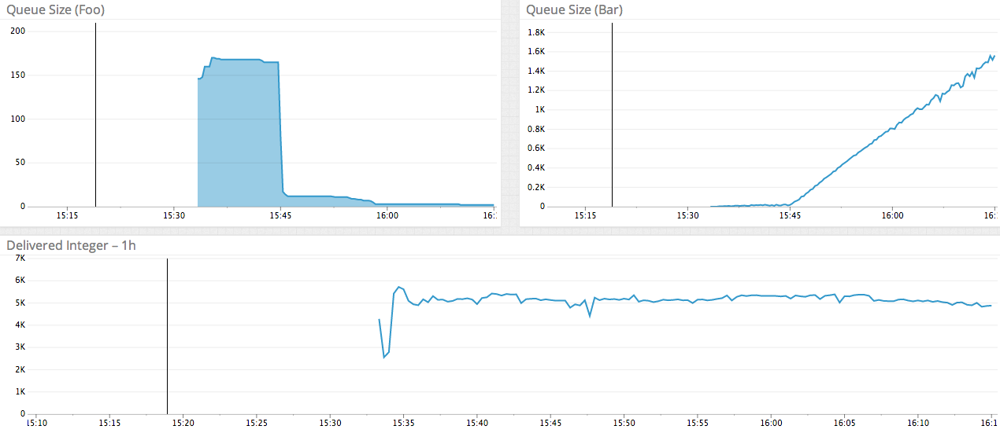
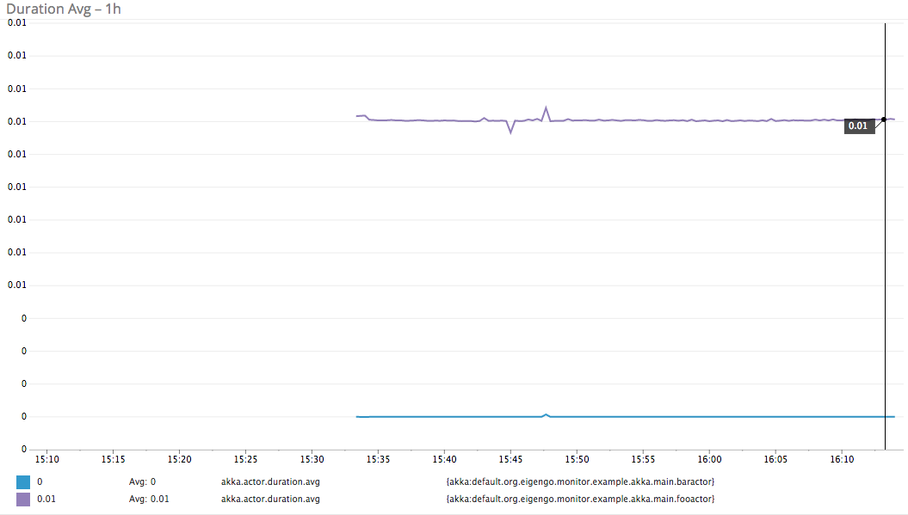
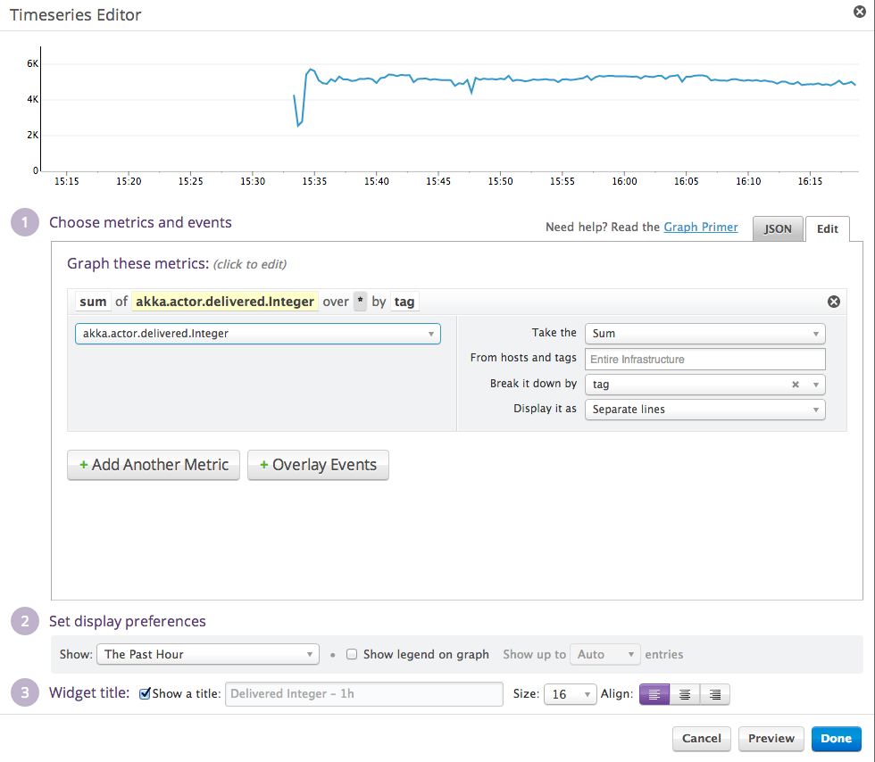
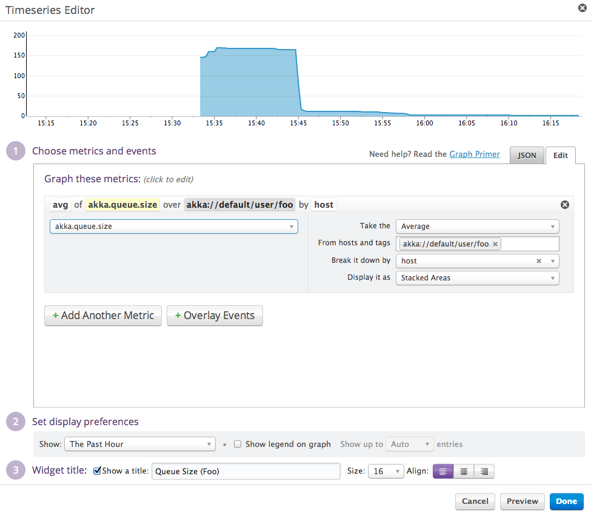

.. _intro:

##########################
Introduction  & motivation
##########################

**Eye on the Typesafe Stack**

The monitoring that this tool provides is *not* on the same level as the insight into your Akka application you get from the Typesafe Console. Use the `Typesafe Console <http://typesafe.com/products/typesafe-subscription>`_ in development, when you really need to lift the hood of the actor system. Use our monitor to keep an eye on a debugged, tuned Akka system that is running in production. Imagine being able to see a chart like this:

In production, you may want to monitor the actors' queues, the number of messages they process, the performance of the ``receive`` function and error rates. In this short introduction, I will show you how to monitor a simple command-line Akka application.::

    object Main extends App {
      val longSleep = 10
      val shortSleep = 1

      class FooActor(bar: ActorRef) extends Actor {
        def receive: Receive = {
          case i: Int if i == 0 =>
            println("Foo done.")
          case i: Int           =>
            println(s"Counting down... Now $i")
            Thread.sleep(longSleep)
            if (i % 10 == 0) bar ! i
            self ! (i - 1)
        }
      }

      class BarActor extends Actor {
        def receive: Receive = {
          case i: Int if i == 0 =>
            println("Bar done.")
          case i: Int           =>
            Thread.sleep(shortSleep)
            self ! (i - 1)
        }
      }

      val system = ActorSystem()
      val bar = system.actorOf(Props[BarActor].
      	withRouter(RoundRobinRouter(nrOfInstances = 10)), "bar")
      val foo = system.actorOf(Props(new FooActor(bar)), "foo")
      val CountPattern = "(\\d+)".r

      def commandLoop(): Unit = {
        Console.readLine() match {
          case "quit"          => return
          case "go"            => (0 to 20).foreach(_ => foo ! 400)
          case CountPattern(i) => foo ! (i.toInt * 10)
          case _               => println("WTF?")
        }

        commandLoop()
      }

      commandLoop()
      system.shutdown()

    }

When you execute this application, and issue a few ``go`` commands; and a few integers to be sure, its ``foo`` and ``bar`` actors are going to keep passing the messages between each other. It is, in essence, a trivial countdown application. We then want to keep an eye on the queue size of both of the actors; and we would like to watch the total number of the ``Int`` messages being passed around.

If you don't want to write the code yourself, all you have to do is to add the ``libraryDependencies``::

    "org.eigengo.monitor" % "agent-akka" % "0.2-SNAPSHOT"
    "org.eigengo.monitor" % "output-statsd" % "0.2-SNAPSHOT"

Once you have the added the dependencies to your module, add files ``/META-INF/aop.xml`` and ``/META-INF/monitor/agent.conf``, start your JVM with ``-javaagent:$PATH-TO/aspectjweaver-1.7.3.jar``, start the `Datadog <http://http://www.datadoghq.com/>`_ agent, and you're all ready to keep an eye on your Akka code.

The monitor structure
=====================

The monitor project is released in `Sonatype Snapshots <https://oss.sonatype.org/content/repositories/snapshots/org/eigengo/monitor>`_; the source code is in the usual place on `GitHub <https://github.com/eigengo/monitor>`_. At the moment the only working agent is the Akka agent, and the only working output module is the statsd / Datadog module. As you can see from the structure, I intend to add monitoring of `Spray <http://spray.io>`_, Play and more detail in Akka IO. Similarly, by popular demand, I will be adding more output modules.

The agents use `AspectJ's load-time weaving <http://www.eclipse.org/aspectj/doc/next/devguide/ltw.html>`_ (in other words, we don't roll our own Akka!). The advices modify Akka's bytecode as it is loaded by the ``ClassLoader``. That explains the need for the obscure ``-javaagent:.../aspectjweaver-1.7.3.jar`` JVM parameter. The weaver contains Java agent, which registers the AspectJ weaver that instruments the classes as they are loaded. To find out what to do, the weaver reads the ``/META-INF/aop.xml`` file. In our case, it contains.

.. code:: xml

    <aspectj>

        <aspects>
            <aspect 
               name="org.eigengo.monitor.agent.akka.ActorCellMonitoringAspect"/>
        </aspects>

        <weaver options="-verbose -XnoInline -showWeaveInfo">
            <include within="akka.actor.*"/>
        </weaver>

    </aspectj>

You can see that weaver applies advices in the ``ActorCellMonitoringAspect`` to classes witin ``akka.actor``. The ``ActorCellMonitoringAspect`` then emits the monitoring messages to the configured output module.

To know which module to use and other configuration details, the agent reads the ``/META-INF/monitor/agent.conf`` file. It specifies the output module, and--optionally--agent-specific settings. An example ``agent.conf`` file is::

    org.eigengo.monitor.agent {
        output {
            class: "org.eigengo.monitor.output.statsd.StatsdCounterInterface"
        }

        akka {
            included: [ "akka://default/user/foo", "akka://default/user/bar" ]
        }
    }

As you can see, it specifies the name of the class that will be responsible for delivering the monitoring messages to the monitoring tool (in our case it is statsd in ``StatsdCounterInterface``); the agent can also receive configuration that specifies which actors to include, and which to exclude. In our small application, we only want to monitor the ``foo`` and ``bar`` actors. (We could have left out the entire ``akka`` node, which would imply *monitor every actor*.)

Datadog
=======

Datadog can receive the statsd messages; and so it is perfectly suited to monitor our Akka application. To get started, head over to `http://www.datadoghq.com/ <http://www.datadoghq.com/>`_, and download the agent for your OS. Then start the agent on your machine. This connects the Datadog web application to the system being monitored. Once you're done, you can start creating dashboards that summarize the information that the monitoring tool sends.

Gallery
=======

Let me complete the article by showing you a few simple charts you can construct using this monitoring tool and Datadog.

.. raw:: latex
    
    \newpage

   Overloaded bar actor

   Performance of the receive function

.. raw:: latex
    
    \newpage

   Configuration of the delivered messages chart

.. raw:: latex
    
    \newpage

   Configuration of the queue size for foo chart

Trying it out
=============
In place of the usual summary, I encourage you to head over to `https://github.com/eigengo/monitor <https://github.com/eigengo/monitor>`_, clone the repository and try running the application by simply typing ``sbt run``, with the Datadog agent configured & running. Then you will be able to re-create the same charts I showed you. I also encourage you to submit feature requests. Of course, I will be delighted to accept your pull requests!
